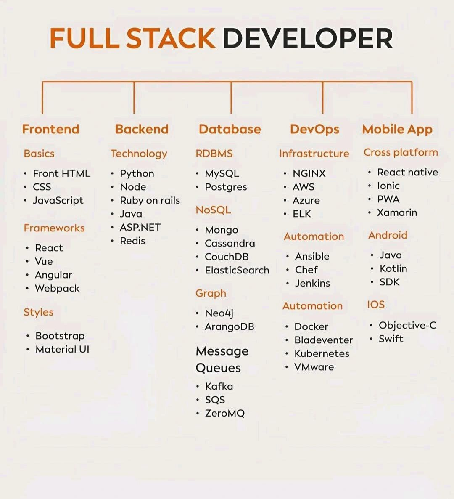

# Angular19App

This project was generated using [Angular CLI](https://github.com/angular/angular-cli) version 19.0.3.

## Development server

To start a local development server, run:

```bash
ng serve
```

Once the server is running, open your browser and navigate to `http://localhost:4200/`. The application will automatically reload whenever you modify any of the source files.

## Github pages optimization
Use Smaller Libraries

Replace moment.js with date-fns

Use lodash-es instead of lodash
Replace rxjs imports with selective imports like

import { map } from 'rxjs/operators';

Tree Shaking & Terser Plugin

Ensure your angular.json has:

"buildOptimizer": true,
"optimization": true

4️ Remove Unused Dependencies

npm prune
npm dedupe

## "sourceMap": false in angular.json only for production build
make it "sourceMap": true for local development

otherwise:

Effects on Local Development
No Debugging with Original Source Code

Without source maps, the browser's developer tools will show only the minified and bundled JavaScript instead of the original TypeScript files.
Errors will point to minified code, making debugging harder.

Difficult to Trace Errors

Instead of seeing:

console.log("Debug message in component.ts");

You'll see something like:

console.log("a.b.c");

Check if Source Maps are Enabled

To check if source maps are working in Chrome DevTools:

Open Developer Tools (F12 or Ctrl + Shift + I).

Go to the Sources tab.

If you see .ts files under webpack:// → Source maps are enabled.

If only .js files appear → Source maps are disabled.


## Why SSR and GitHub Pages Conflict:

the inclusion of server-side rendering (SSR) configurations in your Angular application can affect deployment to GitHub Pages, because GitHub Pages is a static hosting service. It doesn't support executing server-side code, such as the code in server.ts or the SSR setup.

SSR Requires a Server: Server-side rendering in Angular generates the HTML on the server for each route dynamically. GitHub Pages, however, can only serve pre-generated static files.


deploy.yml Behavior: If your deployment pipeline (like in deploy.yml) is attempting to run SSR or relying on server-side files, it won't work because GitHub Pages doesn't provide a runtime environment for executing server code.

What You Need to Do:

If your intent is to deploy to GitHub Pages, you must disable SSR for this deployment and use a static version of your application.

## If You Still Want SSR:
For SSR hosting, you’ll need a different service, such as:

Vercel
Netlify
Firebase Hosting with Cloud Functions
AWS, Azure, or Google Cloud for full server hosting.
These services support server-side environments and can run your SSR code properly.



## Code scaffolding

Angular CLI includes powerful code scaffolding tools. To generate a new component, run:

```bash
ng generate component component-name
```

For a complete list of available schematics (such as `components`, `directives`, or `pipes`), run:

```bash
ng generate --help
```

## Building

To build the project run:

```bash
ng build
```

This will compile your project and store the build artifacts in the `dist/` directory. By default, the production build optimizes your application for performance and speed.

## Running unit tests

To execute unit tests with the [Karma](https://karma-runner.github.io) test runner, use the following command:

```bash
ng test
```

## Running end-to-end tests

For end-to-end (e2e) testing, run:

```bash
ng e2e
```

Angular CLI does not come with an end-to-end testing framework by default. You can choose one that suits your needs.

## Additional Resources

For more information on using the Angular CLI, including detailed command references, visit the [Angular CLI Overview and Command Reference](https://angular.dev/tools/cli) page.
